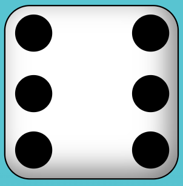

This file is used to document the design choices we made to our yatzy game. 
The overall design we decide on was the keep it simple and minimalistic as our main focus was to make sure the game was functional. 

#### Font 
- The font we have choosen is Segoe UI (San-Serif font) because it gives the vibe of simplicity and easy to read. 

#### Colours
- We wanted to keep the dice as it's true form of being black and white. 
- When you hover over the dice, it will be highlighted grey to indicate that your hovering over it.
- For our background, we would like to have it as a simple light colour that won't over power the scoreboard or the dice. 

#### Components

